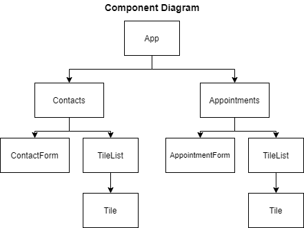

# Appointment planner

To run this, fork this repo, clone the fork locally, and run `npm start`

This project was bootstrapped with [Create React App](https://github.com/facebook/create-react-app).

This is part of Codecademy's Frontend coursework. I've learned React state patterns while implementing stateless components 
that receive and update state for upper components (i.e., React containers), while concentrating all the logic in stateful components "at the top".

See the diagram below:

As a beginner, the hardest part was re-using components for different presentational components.